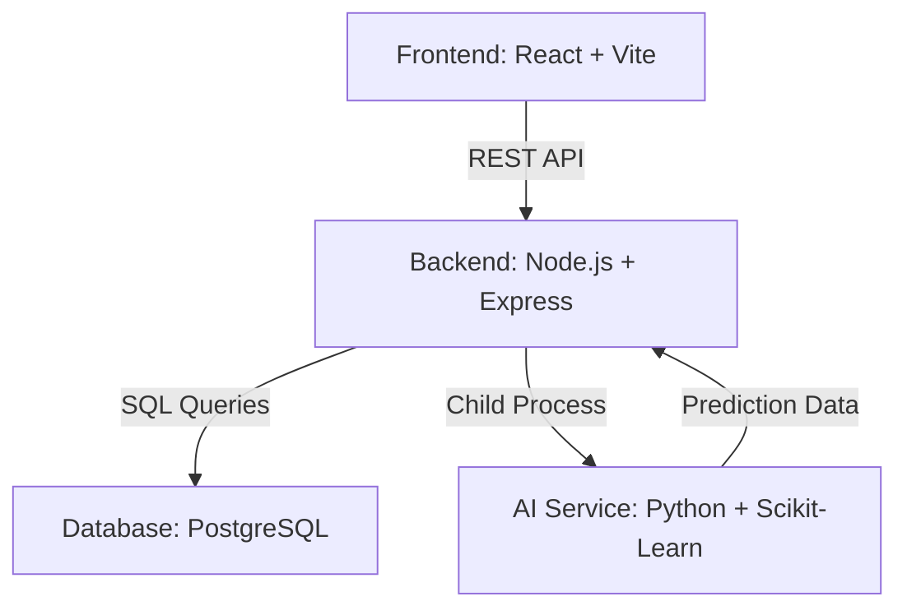

# 💰 Smart AI Expense Tracker

[](https://reactjs.org/)
[](https://nodejs.org/)
[](https://www.postgresql.org/)
[](https://www.python.org/)

A premium, full-stack AI-powered financial management platform that helps users track, analyze, and predict their spending habits using Machine Learning.

---

## ✨ Features

-   **🤖 AI Spending Predictions**: Uses a Linear Regression model (Scikit-Learn) to forecast future expenses based on historical spending.
-   **📈 Interactive Analytics**: Beautiful, real-time dashboards with Chart.js visualizing trends, categories, and budget status.
-   **💡 Smart AI Advisor**: Personalized financial advice generated dynamically from your spending patterns.
-   **🔐 Robust Security**: Secure JWT-based authentication with bcrypt password hashing and protected API routes.
-   **💎 Premium UI**: A modern, glassmorphic dark-theme interface built with Vanilla CSS for maximum performance and aesthetics.
-   **📊 Dynamic Budgeting**: Real-time budget progress tracking with visual alerts when limits are exceeded.

---

## 🏗️ Architecture



---

## 🛠️ Tech Stack

-   **Frontend**: React 18, Vite, Chart.js, Lucide Icons, Axios.
-   **Backend**: Node.js, Express, JWT, Bcrypt, Dotenv.
-   **Database**: PostgreSQL (pg-pool).
-   **AI Model**: Python 3, Scikit-Learn, Pandas, Pickle.

---

## 🚀 Getting Started

### 1. Prerequisites
-   Node.js (v18+)
-   Python 3.x
-   PostgreSQL

### 2. Installation & Setup

#### Backend Setup
```bash
cd backend
npm install
# Configure your .env file with DB credentials
npm start
```

#### AI Model Setup
```bash
cd ai-model
pip install pandas scikit-learn
python train_model.py
```

#### Frontend Setup
```bash
cd frontend
npm install
npm run dev
```

### 3. Database Initialization
Run the queries in `backend/db/init.sql` using your favorite PostgreSQL client to set up the schema.

---

## 📝 License
Distributed under the MIT License. See `LICENSE` for more information.

## 🤝 Contributing
Contributions are what make the open source community such an amazing place to learn, inspire, and create. Any contributions you make are **greatly appreciated**.

1. Fork the Project
2. Create your Feature Branch (`git checkout -b feature/AmazingFeature`)
3. Commit your Changes (`git commit -m 'Add some AmazingFeature'`)
4. Push to the Branch (`git push origin feature/AmazingFeature`)
5. Open a Pull Request

---

*Built with ❤️ for a smarter financial future.*
